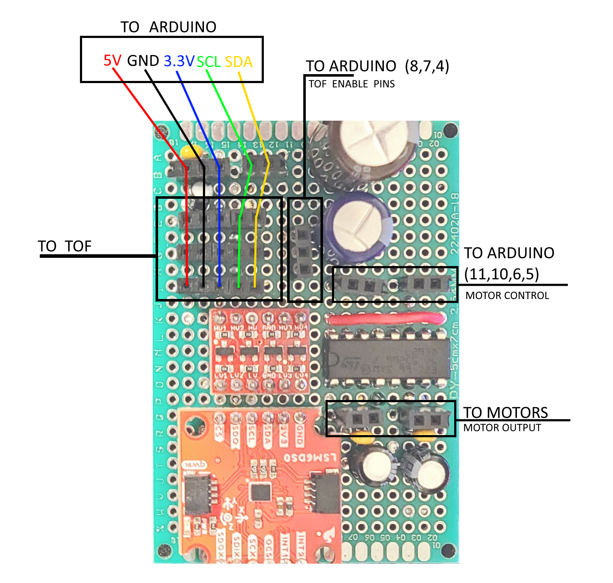

# Oil Retrieval Robot

## Install

1. Download and install the latest [Arduino IDE](https://www.arduino.cc/en/software).
2. Install the libraries for the sensors using the library manager
   1. [VL53L1X by Pololu](https://github.com/pololu/vl53l1x-arduino)
   2. [SparkFun Qwiic 6DoF - LSM6DS0 by Sparkfun Electronics](https://github.com/sparkfun/SparkFun_Qwiic_6DoF_LSM6DSO_Arduino_Library)

## Electrical Setup

The main board with connection markdown is shown below:

### Hook-Up Notes
* When multiple pins are listed, they're listed top-to-bottom, or left-to-right
  * e.g. The top TOF enable pin would be 8 and the bottom 4
* The time of flight sensors have an attached harness of 5 wires. One wire on each harness will have a mark, the wire with the mark should be the left-most pin, i.e. closest to the edge of the board.
* Each motor has 2 wires, each a different color
  * Colors TBA